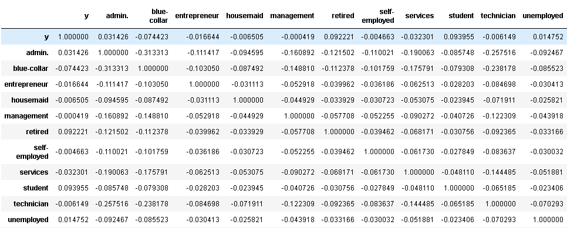

# Marketing for acquiring customers

The purpose of this project is to reduce marketing costs and time by selecting a select group of customers who have something in
common and are more likely to make a deposit rather than making random calls.

The project is mainly a supervised model that can predict based on some input variables if the customer will make a deposit.

A basic analysis on input variables and outputs can reveal some common similarities on the properties of a customer.

#### Jobs

